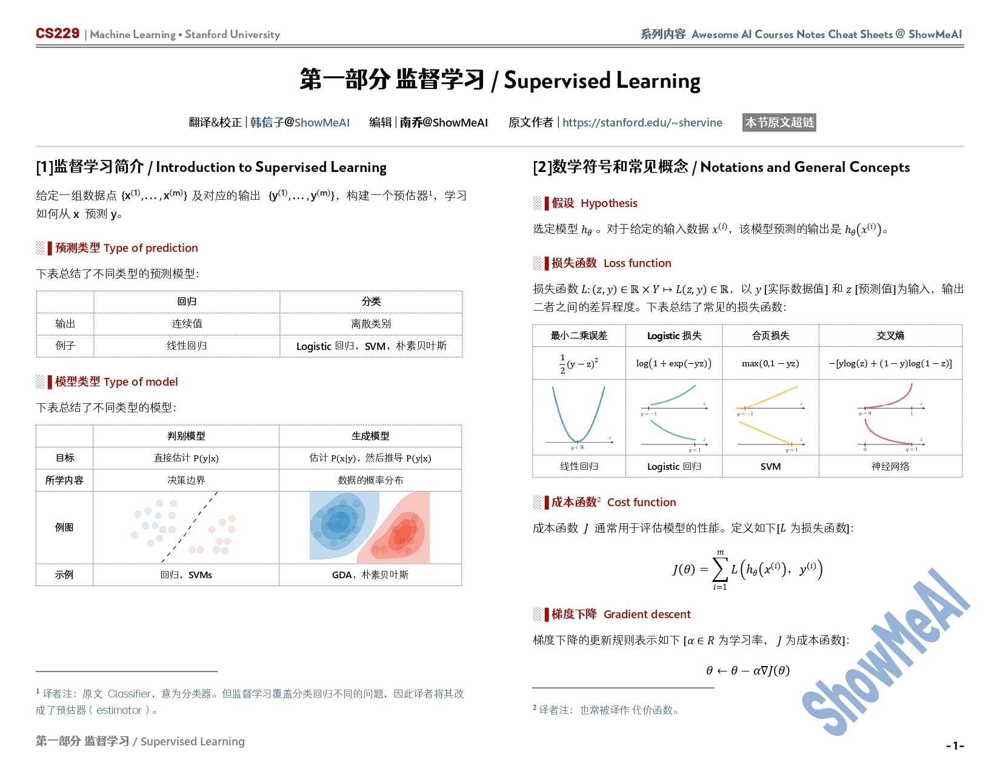
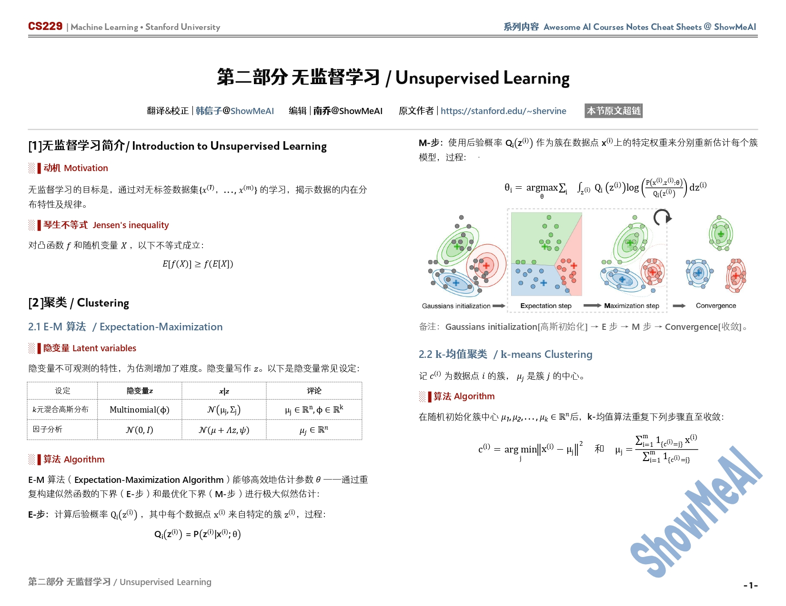
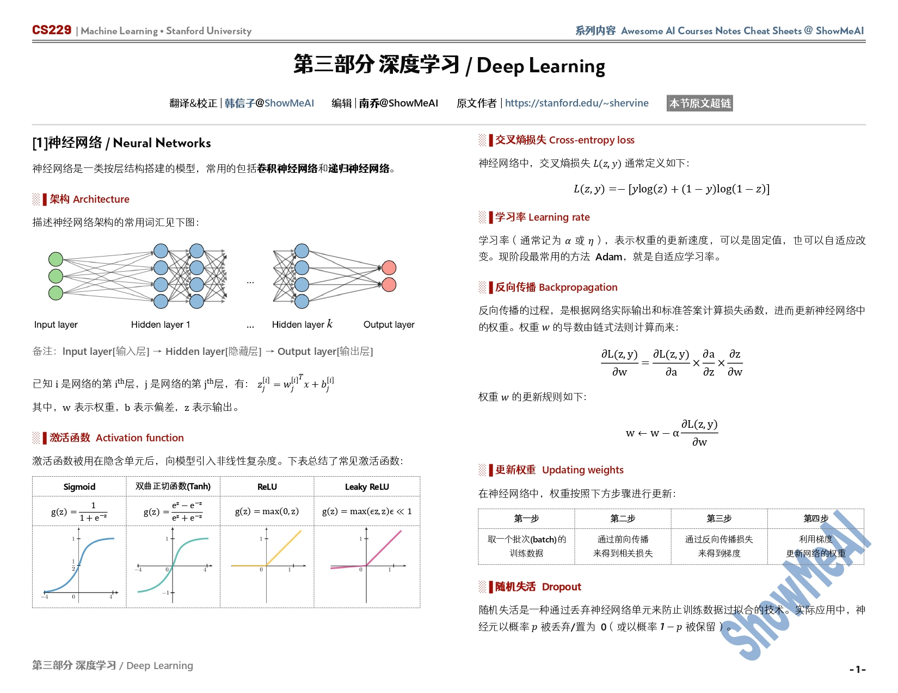
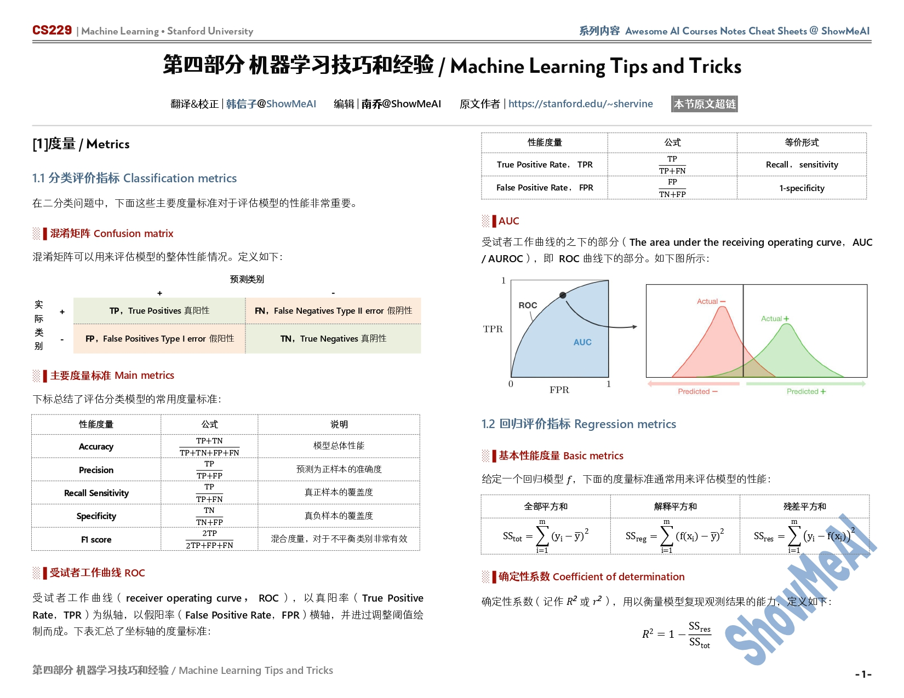
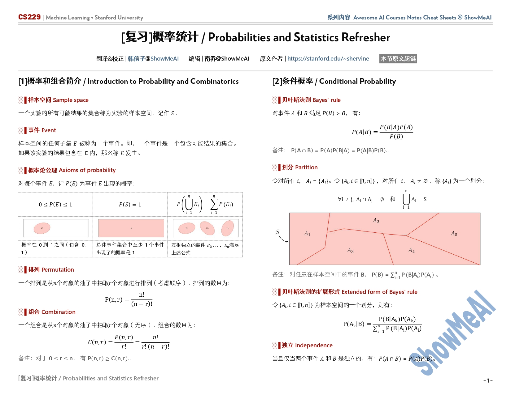
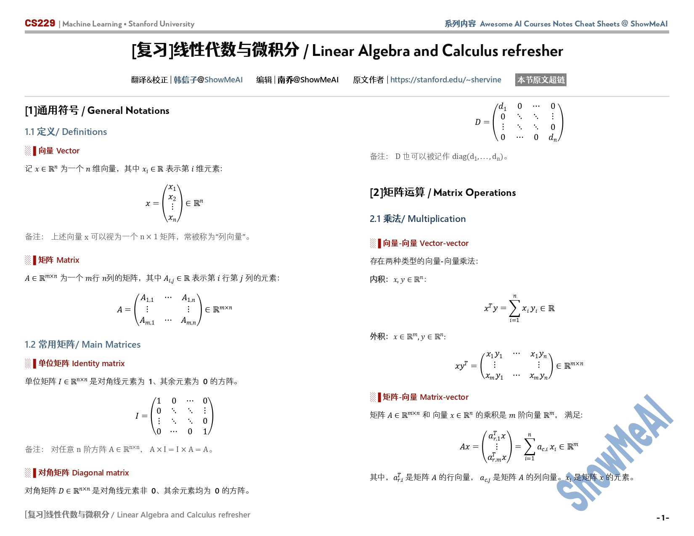

<h1 align="center">
    《CS229机器学习》课程笔记与速查表
     
</h1>

    <strong>斯坦福CS229机器学习课程，内容覆盖监督/无监督学习、强化学习、学习理论</strong>

## 课程介绍
课程主页：[CS229: Machine Learning](http://cs229.stanford.edu/)

斯坦福CS229机器学习课程由吴恩达教授和其他几位教授一起主讲，是机器学习领域里一门非常重要的课程。由于课程质量非常高，是许多人进入人工智能、机器学习领域的基石。

本课程广泛介绍机器学习和统计模式识别。主题包括：
- 监督学习（生成/判别学习、参数化/非参数化学习、神经网络、支持向量机）
- 无监督学习（聚类、维度缩减、核方法）
- 学习理论（偏差/方差权衡，实用建议）
- 强化学习和自适应控制
- 机器学习的最新应用，如机器人控制、数据挖掘、自主导航、生物信息学、语音识别以及文本和网页数据处理

## 前置课程
学生应具有以下背景：

- 掌握计算机科学基本原理和技能，编程能力达到一个水平足以编写一个相对比较复杂的计算机程序 Python/Numpy （CS106A、CS106B、CS106X）。
- 熟悉概率理论（CS 109、MATH151 或 STAT116）。
- 熟悉多变量微积分和线性代数。包括但不限于 MATH51、MATH104、MATH113、CS205、CME100）。

## 课程主题

- 有监督学习：线性回归、逻辑回归、梯度下降、广义线性模型、高斯判别分析、朴素贝叶斯、支持向量机、核方法、决策树与集成方法、神经网络
- 无监督学习：K 均值、高斯混合模型与期望最大算法、因子分析、主成分分析、独立成分分析
- 强化学习：马尔可夫决策过程、值/策略迭代、梯度策略
- 学习理论：偏差/方差权衡，实用建议

---

## 课程笔记内容

<table width="100%"><tr align="center"><td valign="top" width="33.3%">  <h5><a href="https://github.com/ShowMeAI-Hub/awesome-AI-courses-notes-cheatsheets/tree/main/CS229-Machine-Learning/Supervised-Learning">监督学习</a></h5></td>
<td valign="top" width="33.3%">  <h5><a href="https://github.com/ShowMeAI-Hub/awesome-AI-courses-notes-cheatsheets/tree/main/CS229-Machine-Learning/Unsupervised-Learning">无监督学习</a></h5></td>
<td valign="top" width="33.3%">  <h5><a href="https://github.com/ShowMeAI-Hub/awesome-AI-courses-notes-cheatsheets/tree/main/CS229-Machine-Learning/Deep-Learning">深度学习</a></h5></td></tr>
<tr align="center"><td valign="top" width="33.3%">  <h5><a href="https://github.com/ShowMeAI-Hub/awesome-AI-courses-notes-cheatsheets/tree/main/CS229-Machine-Learning/Machine-Learning-tips-and-tricks">机器学习技巧和经验</a></h5></td>
<td valign="top" width="33.3%">  <h5><a href="https://github.com/ShowMeAI-Hub/awesome-AI-courses-notes-cheatsheets/tree/main/Probabilities-and-Statistics">概率与统计</a></h5></td>
<td valign="top" width="33.3%">  <h5><a href="https://github.com/ShowMeAI-Hub/awesome-AI-courses-notes-cheatsheets/tree/main/Linear-Algebra-and-Calculus">线性代数与微积分</a></h5></td>
</tr></table>