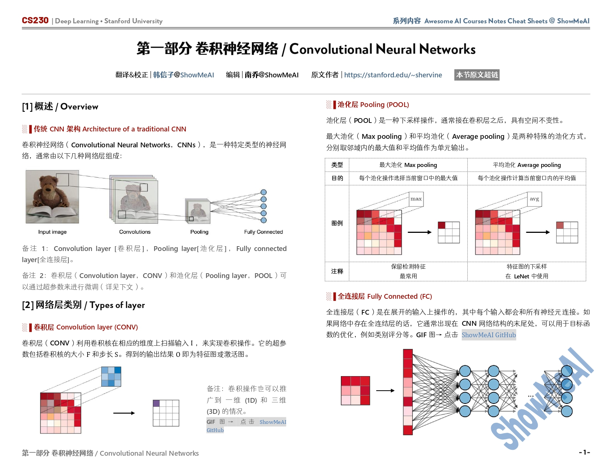
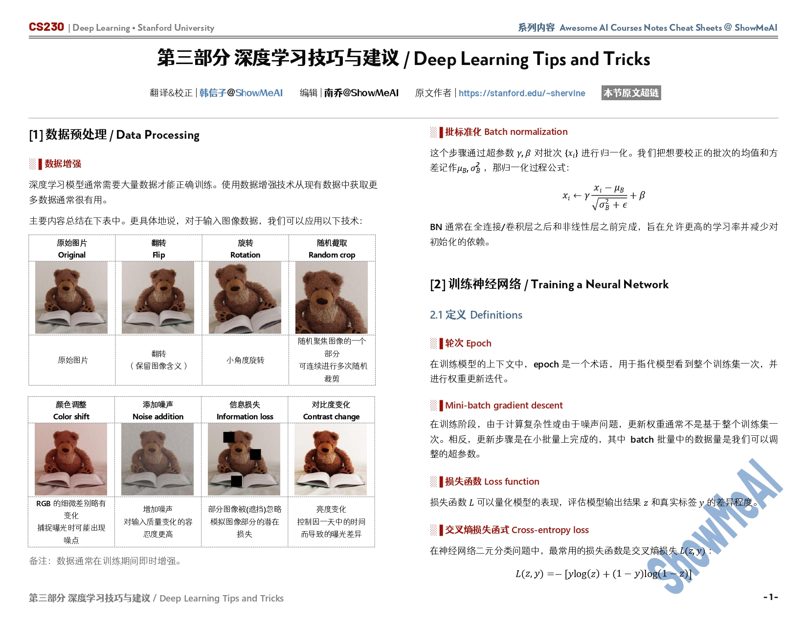

<h1 align="center">
    《CS230深度学习》课程笔记与速查表
     
</h1>

    <strong>斯坦福CS230深度学习课程，内容覆盖卷积神经网络、循环神经网络、网络训练技巧与经验等</strong>

## 课程介绍
课程主页：[CS230: Deep Learning](http://cs230.stanford.edu/)

深度学习是AI领域中最受欢迎的技能之一，斯坦福CS230深度学习课程由吴恩达教授和他的助教Kian Katanforoosh讲授。课程内容覆盖：深度学习的基础，理解如何构建神经网络，卷积神经网络（CNN）、循环神经网络（RNN）、长短期记忆网络（LSTM）、Adam 优化器、Dropout 方法、BatchNorm 方法、Xavier/He 初始化方法等。课程也涉及了深度学习在医疗、自动驾驶、手语识别、音乐生成和自然语言处理等领域的应用案例。

## 前置课程
学生应具有以下背景：

- 掌握计算机科学基本原理和技能，编程能力达到一个水平足以编写一个相对比较复杂的计算机程序 Python/Numpy （CS106A、CS106B、CS106X）。
- 熟悉概率理论（CS 109、MATH151 或 STAT116）。
- 熟悉多变量微积分和线性代数。包括但不限于 MATH51、MATH104、MATH113、CS205、CME100）。

---

## 课程笔记内容

<table width="100%"><tr align="center"><td valign="top" width="33.3%">  <h5><a href="https://github.com/ShowMeAI-Hub/awesome-AI-courses-notes-cheatsheets/tree/main/CS230-Deep-Learning/Convolutional-Neural-Networks">卷积神经网络</a></h5></td>
<td valign="top" width="33.3%">  <h5><a href="https://github.com/ShowMeAI-Hub/awesome-AI-courses-notes-cheatsheets/tree/main/CS230-Deep-Learning/Recurrent-Neural-Networks">循环神经网络</a></h5></td>
<td valign="top" width="33.3%">  <h5><a href="https://github.com/ShowMeAI-Hub/awesome-AI-courses-notes-cheatsheets/tree/main/CS230-Deep-Learning/Deep-Learning-Tips-and-Tricks">深度学习技巧与经验</a></h5></td></tr></table>